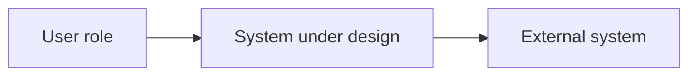

# C4 views guide

Load when choosing or drafting architecture views. Canonical model: [c4model.com](https://c4model.com/).

Most reviews need **context**, **container**, **dynamic**, and (for Large) **deployment**. Add component detail only where risk requires it. Skip code-level diagrams unless debugging a critical module.

## View map

| View | Audience | Show | Do not overload with |
|------|----------|------|----------------------|
| System context | Executives, product, security leaders | Users, system boundary, external systems, major exchanges, purpose | Individual cloud services |
| Container / layered | Architects, engineers, security, ops | Deployable units, stores, protocols, responsibilities, trust boundaries | Every class, queue, or minor library |
| Dynamic | Engineers, testers, reviewers | Ordered request path, decisions, data movement, success and failure | Static infra not in the scenario |
| Deployment / trust | Cloud, DevOps, security, compliance | Accounts/envs, networks, runtimes, secrets, logging, admin paths | Business-process explanation |

## Five-question box test

Every major box must answer:

1. What responsibility does this box own?
2. What information enters and leaves it?
3. Which identity and permissions does it use?
4. What happens when it fails or is unavailable?
5. Which team or role owns its operation and change lifecycle?

A box that cannot answer these is too vague, too large, or not an architectural component.

## Dynamic views to prefer

Create separate dynamic views when material:

- Primary success path
- Authorization denial
- Dependency timeout / unavailable dependency
- Unsafe or invalid output (especially AI)
- Human escalation / rollback-critical path

## Mermaid starter (context)

Label edges with purpose and data, not vague “uses”.
